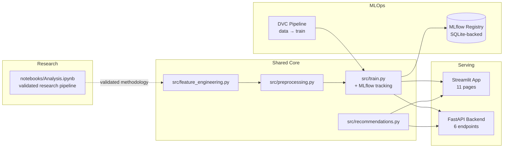

# RetainAI

**Customer Retention Intelligence Platform**

*Predict churn. Explain why. Act in time.*


The Tests badge above is wired to a real CI workflow
([`.github/workflows/tests.yml`](.github/workflows/tests.yml)) that trains
the model and runs all 102 tests plus a Streamlit page-load check on every
push, so it reflects a real, currently-passing pipeline rather than a static
claim.

## What RetainAI is

RetainAI is a customer retention intelligence platform: it predicts which
customers are about to churn, explains *why* in plain terms for each one, and
converts that into a concrete retention action — not just a probability
score. Built as a full production system, not a single notebook: a validated
research pipeline, a modular Python package shared by every surface, a live
app, a REST API, MLOps tracking, tests, containers, and multi-cloud
deployment configs.

**Mission:** give retention teams a model they can actually trust and act
on — every prediction comes with a reason and a recommendation, every design
decision is documented, and every claimed number in this repo has been
verified by actually running the code, not just written down.

*(Naming note: this product was built and validated under the working name
"Telecom Customer Churn Prediction" / "Telecom Customer Retention Intelligence
Platform," briefly rebranded as "RetainIQ," and is now RetainAI — the current
product identity.)*

---

## Overview

Every month, **26.5% of this telecom's customers churn**, costing roughly
**$139,000/month** in recurring revenue. RetainAI catches that risk early,
explains each prediction with SHAP so it's actionable rather than a black
box, and sizes exactly how much of that revenue is recoverable through
targeted retention outreach.

The methodology went through a full research pipeline (see
[`notebooks/Analysis.ipynb`](notebooks/Analysis.ipynb)) before being distilled
into the production `src/` package used by both the app and the API:

| Stage | What it covers |
|---|---|
| EDA | Data quality, distributions, churn-rate breakdowns across every categorical feature |
| Feature Engineering | 12 engineered features; fixed a real dtype bug in categorical encoding |
| Class Imbalance | Compared No Balancing / SMOTE / ADASYN / Class Weights — ADASYN won |
| Model Comparison | 10 models compared on Accuracy/Precision/Recall/F1/ROC AUC — Gradient Boosting won |
| Hyperparameter Tuning | RandomizedSearchCV + GridSearchCV — an honest negative result reported as-is |
| Model Validation | CV, learning/validation curves, ROC/PR curves, calibration, lift/gain chart |
| Explainability | SHAP (global + per-customer), LIME cross-check, permutation importance |
| Business Analytics | Revenue lost to churn, risk by segment, retention-opportunity sizing |
| Customer Segmentation | KMeans / DBSCAN / hierarchical clustering, auto-labeled by risk/value/loyalty |
| AI Retention Engine | SHAP-grounded, per-customer recommendations with an LLM-prompt extension pattern |

Every one of those findings was validated by actually running the notebook
end-to-end, not just written and assumed correct — including catching and
fixing three real bugs along the way (a pandas dtype mismatch, a duplicate
one-hot-encoding bug, and a single-row inference failure), documented in-line
where they were found.

---

## Architecture

See [`docs/architecture.md`](docs/architecture.md) for the full diagram plus
the reasoning behind each major design decision. Short version:



`src/` is the single source of truth for feature engineering and preprocessing
— the app, the API, and the training script all import the same functions, so
there's no risk of the logic drifting out of sync between them (a real bug
class this design specifically avoids — see `docs/architecture.md`).

---

## Features

- **Live churn prediction** for any customer, via app form or REST API
- **Per-customer SHAP explanations** — waterfall plots showing exactly which
  factors drove each prediction, not just a global feature-importance chart
- **Grounded retention recommendations** — SHAP drivers mapped to concrete,
  prioritized actions (not a generic "contact this customer" message)
- **Interactive EDA and business insights** with live filtering
- **Model comparison dashboard** — all 10 candidate models, side by side
- **Customer segmentation** — 4 auto-labeled Risk × Value × Loyalty segments
- **Batch prediction** — upload a CSV, score any number of customers at once,
  get a business summary (revenue at risk, priority breakdown), and download
  either the scored CSV or a branded executive PDF report (KPIs, feature
  importance chart, grounded recommendations, highest-risk customer table)
- **REST API** with Pydantic validation, batch prediction, and Swagger docs
- **MLflow experiment tracking** with a registry gate that only promotes a
  model to "production" if it actually beats the current one
- **102 automated tests** (unit, API, model quality, data validation, reports)
- **Docker + 5-platform cloud deployment configs** (Render, Railway, AWS,
  Azure, GCP)

---

## Tech Stack

**ML / Data:** Python, pandas, NumPy, scikit-learn, XGBoost, LightGBM, CatBoost,
imbalanced-learn, SHAP, LIME
**Serving:** FastAPI, Pydantic, Streamlit, Plotly, Matplotlib
**MLOps:** MLflow (tracking + model registry), DVC (pipeline + data versioning)
**Testing:** pytest, pytest-cov, Streamlit AppTest, FastAPI TestClient
**Infra:** Docker (multi-stage builds), docker-compose, Render / Railway / AWS
App Runner / Azure Container Apps / GCP Cloud Run

---

## Installation

```bash
git clone https://github.com/AashnaTyagi/RetainAi.git
cd RetainAi
pip install -r requirements.txt

python -m src.train          # trains the model, generates all artifacts in models/

streamlit run app/Home.py                     # the app, at localhost:8501
uvicorn backend.main:app --reload             # the API, at localhost:8000/docs
```

Or with Docker (each image trains its own model at build time, fully
self-contained):

```bash
docker compose up --build
```

Full testing and cloud-deployment instructions are in the sections below and
in [`deploy/DEPLOYMENT.md`](deploy/DEPLOYMENT.md).

---

## Screenshots

**Home**


**Dashboard**


**Customer Prediction**


**Explain Prediction (SHAP)**


**Batch Prediction**


---

## Results

**Model comparison (research pipeline, on the notebook's validated split):**

| Model | Accuracy | Precision | Recall | F1 | ROC AUC |
|---|---|---|---|---|---|
| **Gradient Boosting** ⭐ | 0.780 | 0.560 | 0.791 | **0.656** | 0.855 |
| CatBoost | 0.795 | 0.595 | 0.705 | 0.645 | 0.851 |
| Logistic Regression | 0.781 | 0.567 | 0.727 | 0.637 | 0.851 |
| Random Forest | 0.778 | 0.571 | 0.643 | 0.605 | 0.835 |
| XGBoost | 0.778 | 0.581 | 0.579 | 0.580 | 0.818 |
| Decision Tree | 0.708 | 0.458 | 0.560 | 0.504 | 0.662 |

*(Full 10-model table, hyperparameter tuning results, and cross-validation in
the notebook — hyperparameter tuning did **not** beat this untuned baseline,
an honest finding kept in rather than discarded.)*

**Business impact:**
- Overall churn rate: **26.5%** (1,869 of 7,043 customers)
- Monthly recurring revenue lost: **$139,131** (~$1.67M annualized)
- Targeting the model's top-risk decile captures **~29% of churners** at a
  **2.95x lift** over random targeting — ~$41,000/month of addressable revenue

**Production model (`src/train.py`, reproducible run):** Accuracy 0.753,
Precision 0.525, Recall 0.743, F1 0.615, ROC AUC 0.837 — close to but not
identical to the notebook's numbers, since it's a fresh train/test split; both
are legitimate, and this is called out explicitly in the app's Model
Comparison page rather than presented as a single number.

---

## Roadmap

Near-term, in rough priority order:

- Wire the Streamlit app to call the FastAPI backend directly (currently both
  independently import `src/`, which works but doesn't demonstrate the two
  services actually integrated — noted honestly in `deploy/DEPLOYMENT.md`)
- Authentication (JWT + roles) and rate limiting before any public deployment
  with real customer data (see `docs/API.md`)
- Role-based dashboards (CEO / Marketing / Sales / Customer Success / Admin)
- Real-time monitoring (latency, drift, error rate) on top of the existing
  MLflow tracking
- A conversational assistant over the existing SHAP/business-analytics output
  ("why are customers leaving," "summarize this month's churn")
- What-if simulator (adjust a customer's contract/tenure/charges and see the
  prediction update live) — natural extension of the existing Explain
  Prediction page
- A/B test the retention recommendations against an actual pilot campaign to
  replace the illustrative 20% save-rate assumption with a measured one

These are scoped as future work, not implemented in this delivery — listed
here so the direction is clear rather than promised as already built.

## Contributing

See [`CONTRIBUTING.md`](CONTRIBUTING.md).

---

## Resume Bullet Points

> Built RetainAI, an AI-powered customer retention intelligence platform,
> using ensemble machine learning, explainable AI, and business analytics —
> compared 10 classification models, selected the best performer by F1 score,
> and validated it with cross-validation, calibration analysis, and a
> lift/gain chart tying model output directly to revenue impact.

> Developed an end-to-end ML pipeline featuring 12 engineered features,
> ADASYN class-imbalance handling, SHAP/LIME explainability, KMeans/DBSCAN
> customer segmentation, and a grounded AI retention recommendation engine —
> deployed as a Streamlit app and a FastAPI REST service with MLflow
> experiment tracking and 102 automated tests.

> Established MLOps practices for the platform: DVC-versioned data/pipeline,
> an MLflow model registry gated to only promote a new model version if it
> beats the current one, self-training multi-stage Docker builds, a CI
> pipeline running the full test suite plus a live Streamlit smoke check on
> every push, and deployment configs for 5 cloud platforms (Render, Railway,
> AWS, Azure, GCP).

---

## Project Structure

```
RetainAI/
├── src/                   # Shared, reusable pipeline modules (single source of truth)
│   ├── feature_engineering.py
│   ├── preprocessing.py
│   ├── train.py            # MLflow tracking + registry gating
│   └── recommendations.py
├── models/                 # Trained artifacts (generated) + static reference data
├── data/                   # Source dataset (DVC-tracked)
├── app/                    # Streamlit application (11 pages)
├── backend/                 # FastAPI REST API (6 endpoints)
├── docker/                 # Self-training multi-stage Dockerfiles
├── deploy/                 # Render, Railway, AWS, Azure, GCP configs
├── notebooks/Analysis.ipynb # Full validated research pipeline
├── tests/                  # 102 tests: unit, API, model, data validation, reports
├── .github/workflows/       # CI: trains model, runs tests, checks all app pages
├── docs/
│   ├── architecture.md
│   └── API.md
├── docker-compose.yml
├── dvc.yaml
├── pytest.ini
├── CONTRIBUTING.md
├── LICENSE
└── requirements*.txt
```

---

## Testing

```bash
python -m src.train
pytest                                                     # 102 tests
pytest --cov=src --cov=backend --cov-report=term-missing   # coverage
```

Coverage: 100% on `feature_engineering`, `preprocessing`, `recommendations`,
and the API schemas; 88% on the backend. `train.py` is validated by direct
execution rather than unit tests — documented honestly rather than padded.

CI ([`.github/workflows/tests.yml`](.github/workflows/tests.yml)) runs this
exact sequence — train, test, verify every Streamlit page loads — on every
push and pull request to `main`.

---

## License

MIT — see [`LICENSE`](LICENSE).