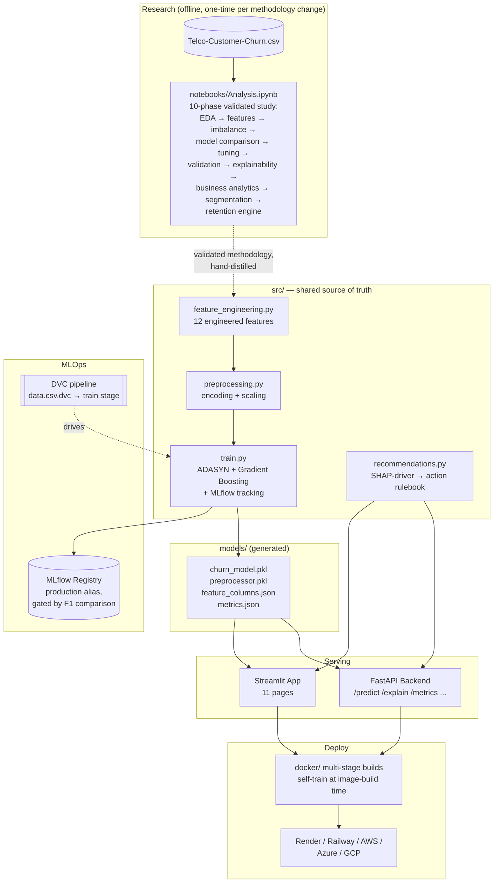

# RetainAI — Architecture

## Design decisions worth calling out

**Why `src/` exists separately from the notebook.** The notebook is where the
10-phase methodology was actually developed and validated — every modeling
decision (ADASYN over SMOTE, Gradient Boosting over the other 9 models,
tuning that didn't help) was tested there first. `src/` is a hand-distilled,
production version of only the *winning* configuration, shared identically by
training, the app, and the API. This is a deliberate one-way flow: findings
move from notebook → `src/`, not the other way, and `src/` never re-runs the
full exploratory comparison.

**Why the app and API don't call each other.** Both independently import
`src/` rather than the app calling the API over HTTP. This avoids a network
hop for what's otherwise the same in-process computation, at the cost of not
demonstrating the two services actually integrated — a real trade-off, noted
honestly in `deploy/DEPLOYMENT.md` as a documented gap rather than glossed
over.

**Why Docker images self-train at build time.** An earlier design used a
shared volume and a one-shot "trainer" container that `backend`/`frontend`
waited on. That pattern is docker-compose-specific and doesn't port to
Render, Railway, App Runner, Container Apps, or Cloud Run, which don't have
"run this once, then start these" as a first-class concept. Multi-stage
builds (train in an isolated build stage, copy only the trained artifacts
into the runtime image) work identically everywhere, including plain
`docker build` with no orchestration at all.

**Why MLflow registry promotion is gated.** A new training run is only
promoted to the `production` alias if its F1 score beats whatever is
currently there — verified by testing, not just documented: a tied rerun
correctly stayed in staging instead of falsely re-promoting (see project
history / test suite for the specifics).
